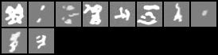
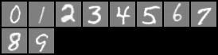
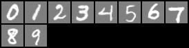
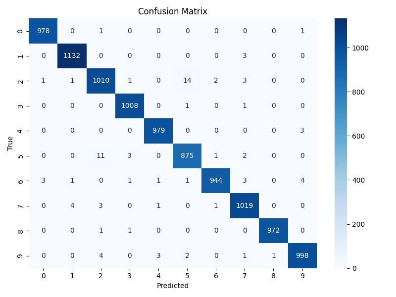
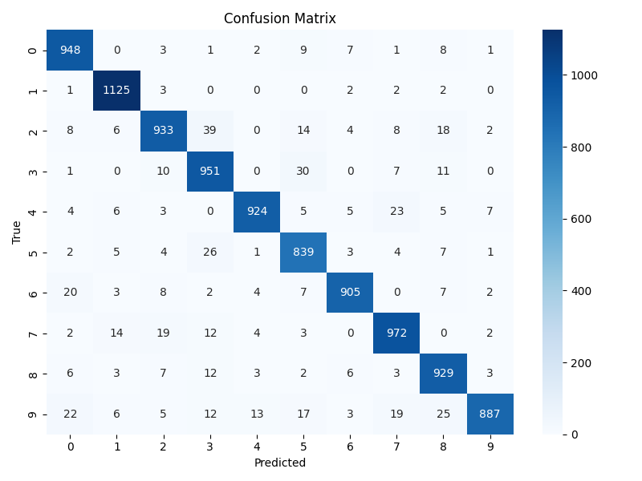
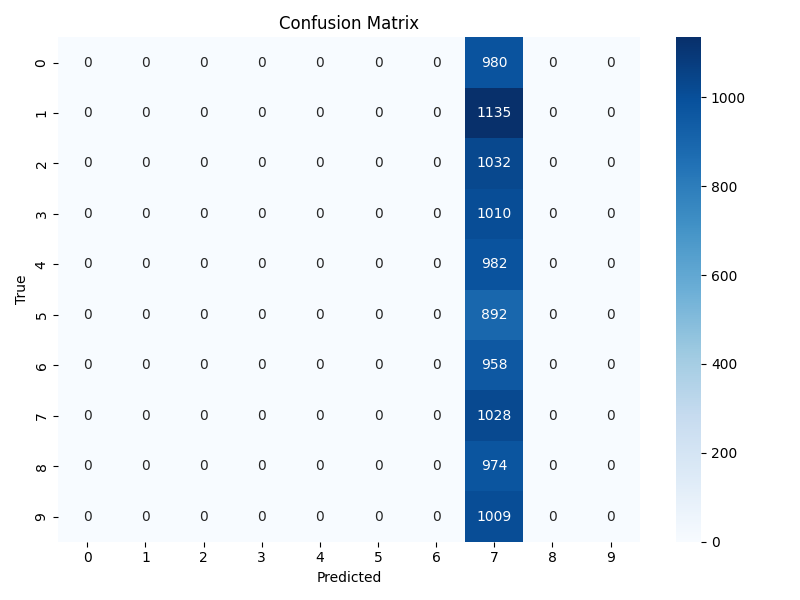
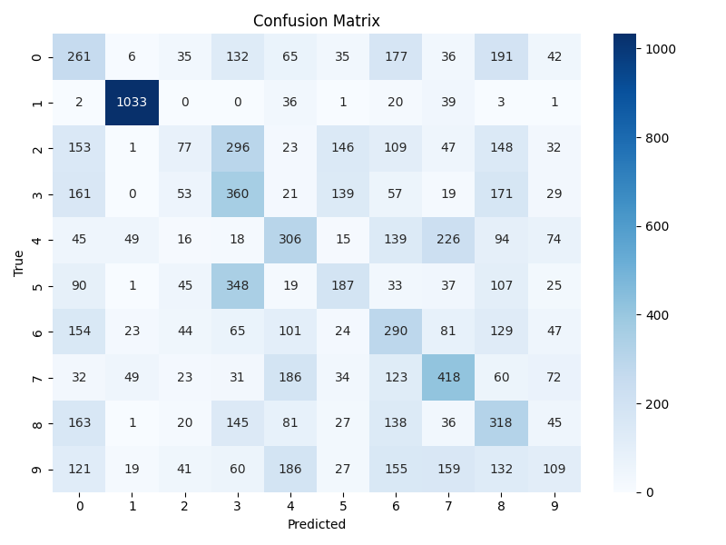
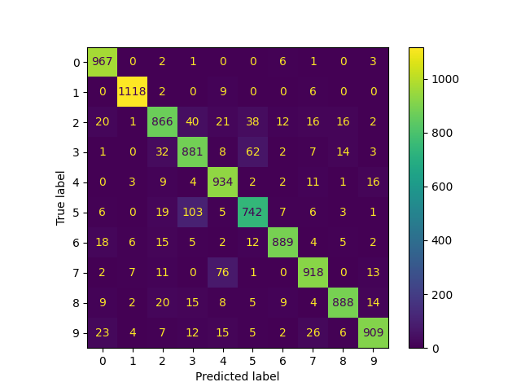
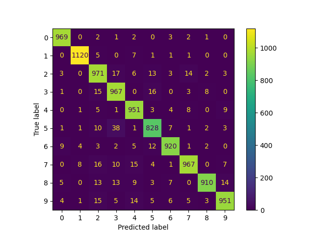

# Description of the Project

This project is the final assignment for the AI Hands-On course of the MSc in Data Science program at [NTUA](https://mathtechfin.math.ntua.gr/?page_id=3661&lang=en).

The objective of the project is to utilize a benchmark dataset, experiment with machine learning algorithms, and develop an API capable of receiving sample input and returning model predictions.

For this purpose, the MNIST dataset was selected due to its popularity and low computational requirements for training models.

The following classical machine learning and deep learning models were used for training on the MNIST dataset:

* RidgeClassifier

* Random Forest

* Support Vector Machine (SVM)

* A modified ResNet-50

* A modified ViT (Vision Transformer)

Additionally, a Denoising Diffusion Probabilistic Model [DDPM](https://arxiv.org/abs/2006.11239) was trained to generate synthetic data. These synthetic samples were used to compare the performance of deep learning models trained on original data versus synthetic data.

Finally, an API endpoint was implemented to allow the generation of a specified number of synthetic samples on demand.

# Get started

To build the project (this may take a while), run:

```bash
bash build_project.sh
```

After running `build_project.sh`, the `checkpoints` directory will be created.

Copy the pre-trained model weights to their corresponding subdirectories inside the `checkpoints` folder.

To send a request to the model and get a prediction for a digit, run:

```bash
python example_request.py
```

To request a specific number of synthetic digit images from the server, use:
```bash
python example_gen_request.py --num 7
```

The outputs will be saved in the `./diffMNISTify` directory:

- `sample_response.json` – contains the prediction response from the model.
- `img_gen_response.png` – contains the generated synthetic digit image.

# Training 

### Data Preprocessing and Augmentation

During training, several transformations were applied to make the model more robust:

- **Channel Repeat**
- **Image Resize**
- **Center Crop**
- **Rescale to [0, 1]**
- **Normalization**
- **Random Rotation**
- **Random Horizontal Flip**
- **Random Vertical Flip**
- **Gaussian Noise**

Since the MNIST dataset consists of single-channel (grayscale) images, we applied a transformation to replicate the channel three times. This was necessary because architectures like **ResNet** and **ViT** expect 3-channel (RGB) input.

An alternative approach—more computationally efficient—is to modify the internal input layer of the model to accept a single channel and average the weights of the first convolutional layer if you're using a pretrained model and intend to fine-tune it.

When using pretrained models (e.g., those trained on **ImageNet-1k**), the following transformations are typically required:

- Resize the image to **256 × 256**
- Perform a **center crop** to obtain a **224 × 224** region
- **Rescale** the pixel values to the range **[0, 1]** (since original images are usually in the [0, 255] range)
- **Normalize** the image using the following statistics (standard for ImageNet):
  - `mean = [0.485, 0.456, 0.406]`
  - `std = [0.229, 0.224, 0.225]`

The final steps—random rotations, horizontal and vertical flips, and the addition of Gaussian noise—are **data augmentation** techniques applied during training. These augmentations help prevent overfitting by introducing variation in the training samples.


### Deep Learning Methods

For the training phase, two main architectures were used:

- **ResNet50** (trained from scratch and fine-tuned using pretrained weights)
- **Vision Transformer (ViT)** (trained from scratch)

The training process involved experimenting with various **hyperparameters** to optimize performance. These included:

- **Learning Rates**: Multiple learning rates were tested to find the most effective value for convergence.
- **Schedulers**: Learning rate schedulers (e.g., StepLR, CosineAnnealingLR) were explored to dynamically adjust the learning rate during training.
- **Optimizers**: Different optimizers were evaluated, including:
  - `SGD` with momentum
  - `Adam`
  - `AdamW` (particularly useful for ViT models)

The ResNet50 architecture was tested under two settings:
- **From Scratch**: Weights initialized randomly and trained entirely on the MNIST dataset.
- **Fine-Tuning**: Using pretrained ImageNet weights, with modifications to the final classification layer.

The training pipeline for these machine learning models is implemented in `train_eval_pipeline_nn.py`

### Classical Machine Learning Methods

The classical machine learning methods we experimented with were:

- **Ridge Classifier**
- **Random Forest**
- **Support Vector Machine (SVM)**

To boost their performance, we used **feature extraction**. Specifically, we utilized the first 9 layers of a pretrained **ResNet** model as a feature extractor. This transformation converts the original 728-dimensional input (from the 28×28 grayscale images) into a 2048-dimensional feature vector.

These extracted features were **precomputed and saved** in the `data/` folder by creating a new dataset, in order to significantly reduce computational overhead during training. This step was performed using the script:

```bash
python precompute_features.py
```

During training:

* Standard normalization was applied to the extracted features.

* A grid search with 3-fold stratified cross-validation was used for hyperparameter tuning.

* The models were trained on a balanced subset of the MNIST dataset, containing 500 samples per class, to minimize compute resource usage.

The training pipeline for these machine learning models is implemented in `train_eval_pipeline_ml.py`

### Diffusion Model: Denoising Diffusion Probabilistic Model (DDPM)

In addition to classical and deep learning models, we implemented a **diffusion-based generative model** adapted from the **Denoising Diffusion Probabilistic Model (DDPM)** framework.

#### Preprocessing

Before training the diffusion model, the MNIST images were **resized to 32×32 pixels** to match the expected input size of the model and to balance training efficiency with image quality.

#### Experimental Setup

We experimented with several key hyperparameters to optimize the performance of the diffusion process:

- **Noise Scheduler**: A **linear beta schedule** was used, where the noise variance increases linearly across diffusion steps.
- **Beta Range**: Different values for the **starting and ending beta** parameters were tested to assess the effect of diffusion intensity.
- **Timesteps**: Various values for the **number of noise steps** were explored to balance training time with sample quality.

These experiments helped identify stable configurations for generating realistic digit images using DDPM.

#### Results

Below are sample outputs from the DDPM model during training at different checkpoints, showing the progressive improvement in image generation quality:

**Epoch 0**:



**Epoch 10**:



**Epoch 15**:



The model was trained in 20 epochs and the script for training is implement in `train_ddpm_conditional.py`

# Results

In the table below, we summarize the evaluation results on the unseen test set of the MNIST dataset. The best performance was achieved by the ResNet50 model trained from scratch, reaching 99% accuracy. The remaining 1% of errors were primarily due to the model misclassifying some digits "2" as "5", as illustrated in the confusion matrix below.

Comparable results were also obtained by the following models, with accuracies ranging from 91% to 96%:

* ResNet50 with fine-tuning

* FEAT-Ridge Classifier

* FEAT-Random Forest

* FEAT-Support Vector Machine

While the **ViT (Vision Transformer)** is a powerful architecture, its performance in this case was poor. This can be attributed to the fact that Transformer-based models are typically data-hungry, and the MNIST dataset is relatively small. As a result, the model likely overfitted the training data. Additionally, the chosen learning rate may not have been optimal.

The ResNet model trained on synthetic data exhibited very poor performance. From its confusion matrix, it is clear that the model predicted nearly every digit as "7". This behavior may be caused by the synthetic images being sampled from a "noiseless" distribution, which differs significantly from the actual distribution of MNIST digits. As a result, the model may have overfitted to a narrow "subset" of the data distribution.

| Model                                 | Accuracy | Precision | Recall |
|---------------------------------------|----------|-----------|--------|
| ResNet50 FineTune                     |   0.9412 |  0.9412   | 0.9412 |
| ResNet50 from scratch                 |**0.9915**| **0.9915**|**0.9915**|
| ResNet50Gen                           |  0.1028  |  0.1028   | 0.1028 |
| ViT from scratch                      |  0.3359  |  0.3359   | 0.3359 |
| FEAT-Ridge Classifier                 |   0.9554 |   0.9558  | 0.9554 |
| FEAT-Random Forest                    |  0.9112  | 0.912     |  0.9112|
| FEAT-Support vector machines (FSVM)   |  0.9664  |  0.9666   | 0.9664 |

## Confusion matrices

#### ReSNet50 From Scratch



#### ReSNet50 Finetune



#### ReSNet50 GenData



#### ViT 


#### F-RandomForest


#### F-RidgeClassifier


#### F-SVM


# API

As mentioned earlier, the API exposes two POST endpoints: `/predict` and `/generate`.

---

### `/predict` Endpoint

The `/predict` endpoint accepts a JSON request containing the field `"img_raw"`, which should be a **list of lists of floats**. This represents the 2D image as nested lists, where each inner list corresponds to a row of pixel values (i.e., a flattened grayscale image reshaped into 2D format).

**Example request:**

```json
{
  "img_raw": [[0.0, 0.1, ..., 0.0], ..., [0.0, 0.2, ..., 0.0]]
}
```

**Response**:

The response is a JSON object with a single field `"number"`, which is an integer representing the predicted digit:

```json
{
  "number": 5
}
```

Preprocessing:

The preprocessing applied at inference time is identical to the training pipeline, excluding the random augmentations and Gaussian noise. If an image contains more than 30% missing values, the API returns an error. If less than 30% is missing, the image is automatically imputed either by:

* Filling missing pixels with 0

* Replacing them with the average of neighboring pixels (similar to a convolutional smoothing technique).

Model Used:

Based on evaluation results, the best-performing model was ResNet50 trained from scratch, which is used for digit recognition in this API.

### `/generate` Endpoint

The `/generate` endpoint accepts a JSON request with a `"number"` field, indicating which digit (0–9) to generate.

**Example request**:

```json
{
  "number": 7
}
```

**Response**:

The API returns a JSON object with an `"img_list"` field, which is a list of lists of integers, representing the pixel values of the generated image:

```json
{
  "img_list": [[12, 18, ..., 0], ..., [5, 9, ..., 2]]
}
```

This endpoint uses the trained conditional diffusion model (DDPM) to generate images corresponding to the requested digit.